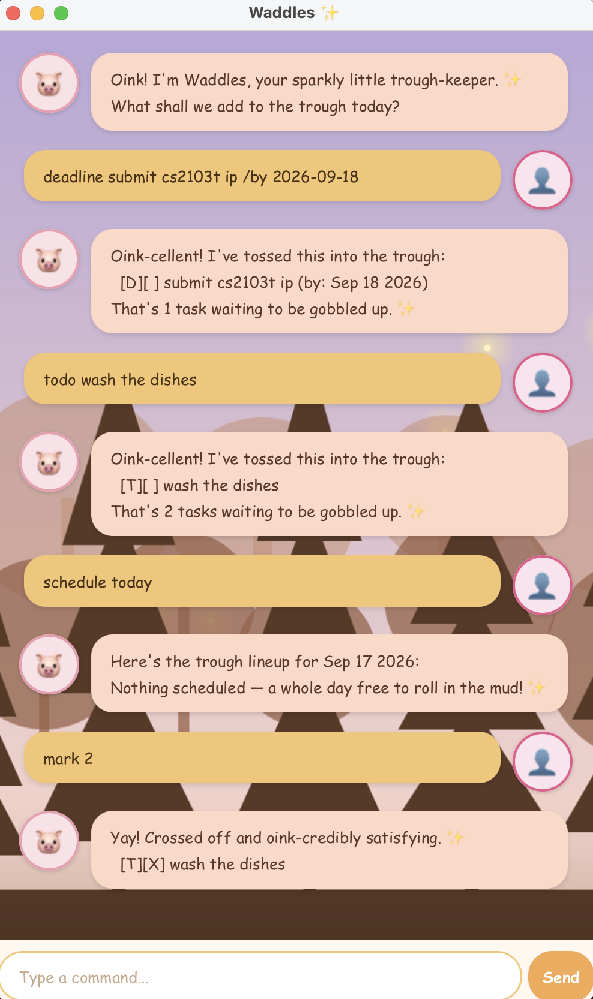

# Waddles User Guide

Waddles is a **desktop chatbot for managing your tasks**, optimized for use via a **Command Line Interface** (CLI) while still having the benefits of a Graphical User Interface (GUI). If you can type fast, Waddles can get your task management done faster than traditional GUI apps.

* [Quick start](#quick-start)
* [Features](#features)
* [FAQ](#faq)
* [Command summary](#command-summary)

--------------------------------------------------------------------------------------------------------------------

## Quick start

1. Ensure you have **Java 25** installed on your computer.
2. Download the latest `waddles.jar` from [here](https://github.com/akoromy/ip/releases).
3. Copy the file to the folder you want to use as the _home folder_ for Waddles.
4. Open a terminal, `cd` into the folder you put the jar file in, and use the `java -jar waddles.jar` command to run the application. A GUI similar to the one below should appear in a few seconds.
5. Type a command in the input box and press Enter (or click the Send button) to try it. Some example commands you can try:
   * `list` : Lists all tasks.
   * `todo Read book` : Adds a todo named "Read book" to the task list.
   * `delete 1` : Deletes the 1st task shown in the current list.
   * `bye` : Exits the app.
6. Refer to the [Features](#features) below for details of each command.

--------------------------------------------------------------------------------------------------------------------

## Features

> **Notes about the command format:**
> * Words in `UPPER_CASE` are the parameters to be supplied by you. 
>   e.g. in `todo DESCRIPTION`, `DESCRIPTION` is a parameter which can be used as `todo Read book`.
> * Items in square brackets are optional. 
>   e.g. `deadline DESCRIPTION /by DATE [/every FREQUENCY]` can be used as `deadline Submit report /by 2026-09-20` or as `deadline Submit report /by 2026-09-20 /every week`.
> * Extraneous parameters for commands that do not take in parameters (such as `list`, `bye`, `undo`) will be ignored. 
>   e.g. if you specify `list 123`, it will be interpreted as `list`.

### Viewing all tasks: `list`

Shows a list of all tasks currently tracked by Waddles.

Format: `list`

### Adding a todo: `todo`

Adds a todo task — one with no date/time attached.

Format: `todo DESCRIPTION`

Example: `todo Read CS2103T textbook`

### Adding a deadline: `deadline`

Adds a task that needs to be done by a specific date.

Format: `deadline DESCRIPTION /by DATE [/every FREQUENCY]`

* `DATE` should be in `yyyy-mm-dd` format, e.g. `2026-09-20`.
* `FREQUENCY` is optional, and makes the deadline recur. Accepted values: `daily`, `weekly`, `monthly` (or `day`, `week`, `month`).

Examples:
* `deadline Submit tP milestone /by 2026-09-20`
* `deadline Pay rent /by 2026-10-01 /every month`

### Adding an event: `event`

Adds a task that occurs over a specific time span.

Format: `event DESCRIPTION /from START /to END [/every FREQUENCY]`

* `START` and `END` should be in `yyyy-mm-dd HHmm` format, e.g. `2026-09-19 1400`.
* `FREQUENCY` works the same way as for deadlines.

Example: `event Team meeting /from 2026-09-19 1400 /to 2026-09-19 1500`

### Marking a task as done: `mark`

Marks the specified task as completed.

Format: `mark INDEX`

* Marks the task at the specified `INDEX` as done. The index refers to the index number shown in the current displayed task list.
* `INDEX` must be a positive integer that exists in the current list.

Example: `mark 2` marks the 2nd task in the list as done.

### Marking a task as not done: `unmark`

Reverses `mark`, setting a task back to not-done.

Format: `unmark INDEX`

Example: `unmark 2`

### Deleting a task: `delete`

Removes the specified task from the list.

Format: `delete INDEX`

Example: `delete 3` deletes the 3rd task in the current list.

### Finding tasks: `find`

Finds tasks whose description contains the given keyword.

Format: `find KEYWORD`

Example: `find book` returns any task containing "book" in its description, e.g. "Read book".

### Viewing your schedule: `schedule`

Shows all tasks due/occurring on a specific date.

Format: `schedule DATE`

* `DATE` can be a specific date in `yyyy-mm-dd` format, or the word `today`.

Examples:
* `schedule 2026-09-20`
* `schedule today`

### Undoing your last action: `undo`

Reverses the effect of your most recent task-changing command (e.g. an `add`, `delete`, `mark`, or `unmark`).

Format: `undo`

* Waddles keeps a single-step undo — it reverses only your **most recent** change, not a longer history. Running `undo` twice in a row will not undo two separate actions.

### Exiting the program: `bye`

Exits Waddles.

Format: `bye`

### Saving the data

Waddles' task data is saved automatically to disk after every command that changes the data. There is no need to save manually.

--------------------------------------------------------------------------------------------------------------------

## FAQ

**Q**: How do I transfer my data to another computer? 
**A**: Install Waddles on the other computer, then copy over the data file it created on your original computer.

**Q**: What happens if my data file is missing or corrupted? 
**A**: Waddles will start with an empty task list rather than crashing, and will create a fresh data file the next time it saves.

--------------------------------------------------------------------------------------------------------------------

## Command summary

| Action | Format | Example |
|---|---|---|
| **List** | `list` | `list` |
| **Todo** | `todo DESCRIPTION` | `todo Read book` |
| **Deadline** | `deadline DESCRIPTION /by DATE [/every FREQUENCY]` | `deadline Submit report /by 2026-09-20` |
| **Event** | `event DESCRIPTION /from START /to END [/every FREQUENCY]` | `event Team sync /from 2026-09-19 1400 /to 2026-09-19 1500` |
| **Mark** | `mark INDEX` | `mark 2` |
| **Unmark** | `unmark INDEX` | `unmark 2` |
| **Delete** | `delete INDEX` | `delete 3` |
| **Find** | `find KEYWORD` | `find book` |
| **Schedule** | `schedule DATE` | `schedule today` |
| **Undo** | `undo` | `undo` |
| **Exit** | `bye` | `bye` |
